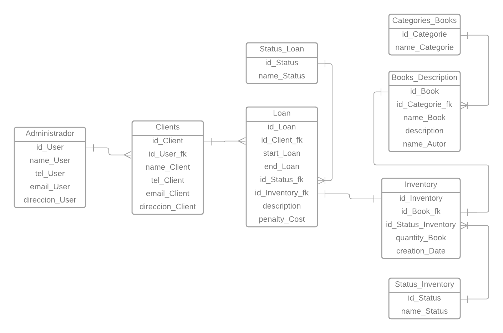
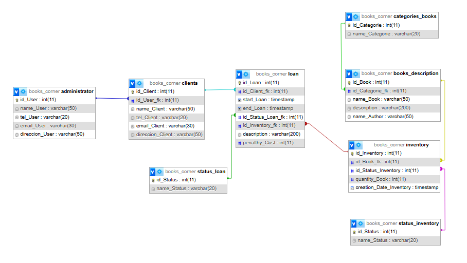

# **Books Corner**


#### `INTRODUCCIÓN`

Un elemento clave en el funcionamiento efectivo de una biblioteca es un sistema de gestión de inventarios que permita un control preciso de los libros disponibles, las reservas y los préstamos.

El Sistema de Gestión de Inventarios de una biblioteca es una herramienta integral diseñada para optimizar el flujo de libros y mejorar la experiencia de los usuarios. 

Una de las características principales del sistema es la capacidad de prestar libros. Los usuarios pueden realizar búsquedas en el catálogo en línea y verificar la disponibilidad de los libros. El sistema mantiene un registro actualizado de los libros prestados, las fechas de vencimiento y las multas en caso de retrasos, esto asegura un control efectivo de los recursos y evita la pérdida o extravío de los libros.

Además de los préstamos, el sistema permite a los usuarios realizar reservas de libros que están actualmente prestados, en tal caso de que el usuario llegue a ir a la biblioteca por un libro y no se encuentre con disponibilidad, los usuarios serán notificados cuando esté disponible para su recogida, esto facilita el acceso equitativo a los libros más solicitados y garantiza una distribución justa.

El sistema de gestión de Inventarios de una biblioteca es una solución integral diseñada para facilitar la gestión eficiente de los recursos bibliográficos, permite el préstamo de libros y reserva, con esta herramienta, las bibliotecas pueden optimizar sus operaciones, mejorar la experiencia de los usuarios y mantener un control preciso de su inventario.


#### `PLANTEAMIENTO DEL PROBLEMA`

Las bibliotecas desempeñan un papel fundamental en la difusión del conocimiento y el acceso a la información, sin embargo, a medida que las colecciones bibliográficas crecen, surge la necesidad de implementar un sistema de gestión de inventarios eficiente que aborde los desafíos existentes.

1. `Descontrol en el inventario:` Sin un sistema de gestión centralizado, la biblioteca puede enfrentar dificultades para realizar un seguimiento preciso de los libros disponibles.

  

2. `Ineficiencia en los préstamos:` En ausencia de un sistema adecuado, los préstamos de libros pueden volverse confusos, La falta de un registro actualizado de los libros prestados puede llevar a situaciones en las que los usuarios no puedan acceder a los libros.

  

3. `Dificultad para gestionar reservas:` Si no hay un sistema de reservas integrado, los usuarios pueden enfrentar obstáculos para reservar libros que están actualmente prestados.

   

4. `Limitaciones en la generación de informes:` Sin un sistema de gestión de inventarios eficiente, la biblioteca puede enfrentar desafíos para generar informes y estadísticas precisas sobre el uso de los recursos, la demanda de libros específicos o el estado general del inventario.


#### OBJETIVO GENERAL

Resaltar la importancia de establecer un sistema de gestión de inventarios eficiente en una biblioteca, con el propósito de optimizar y agilizar el flujo de libros, mejorar la experiencia de los usuarios y asegurar un control preciso y actualizado del inventario bibliográfico. Este sistema integral tiene como objetivo principal facilitar y mejorar el proceso de préstamo de libros, así como garantizar un acceso equitativo a los recursos bibliográficos a través de la implementación de reservas y notificaciones para los usuarios. Además, este sistema busca minimizar la pérdida o extravío de libros al mantener un registro exhaustivo de los libros prestados, las fechas de vencimiento y las multas correspondientes en caso de retrasos, lo que contribuye a un control efectivo de los recursos y a la gestión eficiente de la biblioteca en su conjunto.


#### OBJETIVOS ESPECIFICOS

1. Implementar un sistema de gestión de inventarios que permita mantener un registro actualizado de todos los libros disponibles en la biblioteca, incluyendo información detallada sobre cada libro, como título, autor, descripción y categoría.


2. Establecer un sistema de alertas para el personal de la biblioteca que les notifique sobre la cantidad de copias disponibles para cada libro y cuándo se están agotando.


3. Proporcionar una interfaz de administración para que el personal de la biblioteca pueda agregar, modificar o eliminar registros de libros, actualizar el estado de los préstamos y reservas, y generar informes sobre el uso y la disponibilidad de los recursos bibliográficos.


4. Realizar pruebas exhaustivas del sistema antes de su implementación completa para asegurar su funcionalidad y confiabilidad, corrigiendo posibles errores o problemas identificados durante el proceso de prueba.


##### CONSULTAS

1.  Consultar la cantidad de clientes que hay en la base de datos.

2. Consultar el registro de clientes que tengan un "Penalthy Cost".

3.  Consultar el registro de clientes que llevaron un libro en especifico.

4. Consultar el registro de clientes que están en estado de "Overdue".

5.  Consultar la cantidad que hay en inventario respecto a ese libro.

6. Consultar si en el inventario hay algún registro con el estado de "Out of Stock".

7. Consultar que clientes llevaron libros con la categoría de "Mystery".

8. Consultar todos los libros disponibles en la biblioteca junto con su categoría y cantidad en inventario.

9. Consultar los detalles de un libro específico, incluyendo su descripción y autor.

10. Consultar todos los préstamos activos de un usuario en especifico.

11. Consultar la cantidad total de multas acumuladas por un usuario específico.


​    


#### DIAGRAMA DE ENTIDAD RELACIÓN




#### BASE DE DATOS




## Instalación

1. Para descargar Node.js ve a la siguiente página "[Download | Node.js (nodejs.org)](https://nodejs.org/en/download)".

2. Descarga la versión de Node.js correspondiente a su sistema operativo.

3. Clona este repositorio en tu máquina local.

4. Abre una terminal en el editor de código de tu preferencia, se recomienda "Visual Studio Code".

5. Ejecuta el siguiente comando para instalar las dependencias:

   `NOTA:` Las dependencias a utilizar ya vienen dentro del proyecto, solo clone el repositorio y abra la terminal e ingrese el siguiente comando.

```
npm install;
```

1. Una vez instaladas las dependencias, tienes que ejecutar el nodemon de la siguiente manera y también ejecutar el tsc.

   `npm run dev;`

   `npm run tsc;`


## Configuración

1. Asegurarse de tener creada la base de datos, si no cuentas con una base de datos, este proyecto ya trae una por defecto en la ruta `db/db.sql`
2. Crea un archivo `.env` en el directorio raíz de la aplicación.
3. Dentro del archivo `.env` , define las siguientes variables de entorno:

```
MY_CONFIG={"hostname": "", "port": }
MY_CONNECT={"host": "", "user": "", "password": "", "database": "", "port": "3306"}
```


## Uso

Puedes probar diferentes rutas accediendo a:

- `http://"hostname":"port"/administrator` ruta relacionada con datos administrativos.
- `http://"hostname":"port"/clients` ruta relacionada con clientes.
- `http://"hostname":"port"/status_loan` ruta relacionada con estados de los prestamos.
- `http://"hostname":"port"/loan` ruta relacionada con prestamos.
- `http://"hostname":"port"/categorie_book` ruta relacionada con la categorías de libros.
- `http://"hostname":"port"/book_description` ruta relacionada con la descripción de los libros.
- `http://"hostname":"port"/inventory` ruta relacionada con inventarios.
- `http://"hostname":"port"/status_inventory` ruta relacionada el estado del inventario.


## Consultas

Puedes probar las consultas accediendo a las siguientes rutas:

- `http://"hostname":"port"/consultaClients/cantidad` 
- `http://"hostname":"port"/consultaClients/penalthy` 
- `http://"hostname":"port"/consultaClients/libro/1` 
- `http://"hostname":"port"/consultaClients/status`
- `http://"hostname":"port"/consultaInventory/cantidad/1`
- `http://"hostname":"port"/consultaInventory/status`
- `http://"hostname":"port"/consultaClients/categoria`
- `http://"hostname":"port"/consultaInventory/all_books`
- `http://"hostname":"port"/consultaBooks`
- `http://"hostname":"port"/consultaClients/loan/1041566753`
- `http://"hostname":"port"/consultaClients/penalthy/1102312312`


​	`NOTA:` Las consultas aparecen al inicio de este README.


## Validaciones

El sistema cuenta con validaciones al momento de ingresar datos en la base de datos hechas en Typescript, el sistema valida cada campo y su tipo de dato, si el dato no es correcto le muestra un error.


# EndPoint de Administrator

#### GET: `http://"hostname":"port"/administrator`

Este EndPoint devuelve una lista de administradores existentes.

```
[
  {
    "id_User": 1,
    "name_User": "John Doe",
    "tel_User": "+123456789",
    "email_User": "john.doe@email.com",
    "direccion_User": "123 Main Street"
  },
  {
    "id_User": 2,
    "name_User": "Jane Smith",
    "tel_User": "+987654321",
    "email_User": "jane.smith@email.com",
    "direccion_User": "456 Park Avenue"
  },
  ...
]
```


#### POST: `http://"hostname":"port"/administrator`

Este EndPoint permite agregar un nuevo administrador.

**Parámetros de entrada:**

- `Name` : Nombre del administrador.
- `Phone`: Numero de teléfono del administrador.
- `Email` : Email del administrador.
- `Address`: Dirección del administrador.

**Ejemplo:**

```
{
   "Name": "Jhon Almeida",
   "Phone": "+57 3200021321",
   "Email": "jhon@gmail.com",
   "Address": "Calle 51 Transversal"
}
```


#### PUT: `http://"hostname":"port"/administrator/:id`

Este EndPoint permite actualizar los campos de la tabla de administrador.

```
{
   "Name": "Jhon Hernandez",
   "Phone": "+57 3200021321",
   "Email": "jhon@gmail.com",
   "Address": "Calle 12 Transversal"
}
```


#### DELETE: `http://"hostname":"port"/administrator/:id`

Este EndPoint permite eliminar los campos de la tabla de administrador.


# EndPoint de Books Description

#### GET: `http://"hostname":"port"/book_description`

Este EndPoint devuelve una lista de book description existentes.

```
[
  {
    "id_Book": 1,
    "id_Categorie_fk": 1,
    "name_Book": "The Great Gatsby",
    "description": "A classic novel set in the Jazz Age.",
    "name_Author": "F. Scott Fitzgerald"
  },
  {
    "id_Book": 2,
    "id_Categorie_fk": 2,
    "name_Book": "Dune",
    "description": "An epic science fiction novel.",
    "name_Author": "Frank Herbert"
  },
  ...
]
```


#### POST: `http://"hostname":"port"/book_description`

Este EndPoint permite agregar un nuevo book.

**Parámetros de entrada:**

- `ID_Categorie` : ID de la categoría del libro.
- `Name_Book` : Nombre del libro.
- `Description` : Descripción del libro.
- `Author`: Autor del libro.

**Ejemplo:**

```
{
    "ID_Categorie": 2,
    "Name_Book": "El libro de los tesoros",
    "Description": "An epic science fiction novel.",
    "Author": "Frank Herbert"
}
```


#### PUT: `http://"hostname":"port"/book_description/:id`

Este EndPoint permite actualizar los campos de la tabla de book description.

```
{
    "ID_Categorie": 2,
    "Name_Book": "El libro de los tesoros",
    "Description": "An epic science fiction novel.",
    "Author": "Frank Herbert"
}
```


#### DELETE: `http://"hostname":"port"/book_description/:id`

Este EndPoint permite eliminar los campos de la tabla de book description.


# EndPoint de Categorie Books

#### GET: `http://"hostname":"port"/categorie_book`

Este EndPoint devuelve una lista de categorias existentes.

```
[
  {
    "id_Categorie": 1,
    "name_Categorie": "Fiction"
  },
  {
    "id_Categorie": 2,
    "name_Categorie": "Science Fiction"
  },
  ...
]
```


#### POST: `http://"hostname":"port"/categorie_book`

Este EndPoint permite agregar una nueva categoria.  

**Parámetros de entrada:**

- `Name_Categorie` : Nombre de la categoría del libro.

**Ejemplo:**

```
{
    "Name_Categorie": "Fiction"
}
```


#### PUT: `http://"hostname":"port"/categorie_book/:id`

Este EndPoint permite actualizar los campos de la tabla de categorías de libros.

```
{
    "Name_Categorie": "Fiction"
}
```


#### DELETE: `http://"hostname":"port"/categorie_book/:id`

Este EndPoint permite eliminar los campos de la tabla de categorías de libros.


# EndPoint de Clients

#### GET: `http://"hostname":"port"/clients`

Este EndPoint devuelve una lista de clientes existentes.

```
[
  {
    "id_Client": 1021231232,
    "id_User_fk": 2,
    "name_Client": "Bob Williams",
    "tel_Client": "+222222222",
    "email_Client": "bob.williams@email.com",
    "direccion_Client": "222 Maple Avenue"
  },
  {
    "id_Client": 1041566753,
    "id_User_fk": 3,
    "name_Client": "Eva Martinez",
    "tel_Client": "+333333333",
    "email_Client": "eva.martinez@email.com",
    "direccion_Client": "333 Pine Road"
  },
  ...
]
```


#### POST: `http://"hostname":"port"/clients`

Este EndPoint permite agregar un nuevo cliente.  

**Parámetros de entrada:**

- `Cc` : Cedula del cliente.
- `ID_Admin` : ID del administrador.
- `Name` : Nombre del cliente.
- `Phone` : Teléfono del cliente.
- `Email` : Email del cliente.
- `Address` : Dirección del cliente.

**Ejemplo:**

```
{
    "Cc": 1021231232,
    "ID_Admin": 2,
    "Name": "Bob Williams",
    "Phone": "+222222222",
    "Email": "bob.williams@email.com",
    "Address": "222 Maple Avenue"
}
```


#### PUT: `http://"hostname":"port"/clients/:id`

Este EndPoint permite actualizar los campos de la tabla de clientes.

```
{
    "Cc": 1021231232,
    "ID_Admin": 2,
    "Name": "Bob Williams",
    "Phone": "+222222222",
    "Email": "bob.williams@email.com",
    "Address": "222 Maple Avenue"
}
```


#### DELETE: `http://"hostname":"port"/clients/:id`

Este EndPoint permite eliminar los campos de la tabla de clientes.


# EndPoint de Inventory

#### GET: `http://"hostname":"port"/inventory`

Este EndPoint devuelve una lista de inventarios existentes.

```
[
  {
    "id_Inventory": 1,
    "id_Book_fk": 1,
    "id_Status_Inventory": 2,
    "quantity_Book": 13,
    "creation_Date_Inventory": "2023-07-22T22:13:31.000Z"
  },
  {
    "id_Inventory": 2,
    "id_Book_fk": 2,
    "id_Status_Inventory": 2,
    "quantity_Book": 5,
    "creation_Date_Inventory": "2023-07-22T22:13:31.000Z"
  },
  ...
]
```


#### POST: `http://"hostname":"port"/inventory`

Este EndPoint permite agregar un nuevo inventario.  

**Parámetros de entrada:**

- `ID_Book` : ID del libro.
- `ID_Status_Inventory` : ID del estado del inventario.
- `Count` : Cantidad existente de ese libro.

**Ejemplo:**

```
{
    "ID_Book": 2,
    "ID_Status_Inventory": 2,
    "Count": 2
}
```


#### PUT: `http://"hostname":"port"/inventory/:id`

Este EndPoint permite actualizar los campos de la tabla de inventarios.

```
{
    "ID_Book": 2,
    "ID_Status_Inventory": 2,
    "Count": 2
}
```


#### DELETE: `http://"hostname":"port"/inventory/:id`

Este EndPoint permite eliminar los campos de la tabla de inventarios.


# EndPoint de Loan

#### GET: `http://"hostname":"port"/loan`

Este EndPoint devuelve una lista de prestamos existentes.

```
[
  {
    "id_Loan": 1,
    "id_Client_fk": 1021231232,
    "start_Loan": "2023-07-23T03:15:00.000Z",
    "end_Loan": "2023-07-19T05:00:00.000Z",
    "id_Status_Loan_fk": 1,
    "id_Inventory_fk": 1,
    "description": "The jhon sadsaGatsby",
    "penalthy_Cost": 1000
  },
  {
    "id_Loan": 2,
    "id_Client_fk": 1041566753,
    "start_Loan": "2023-07-22T22:15:00.000Z",
    "end_Loan": "2023-07-19T05:00:00.000Z",
    "id_Status_Loan_fk": 1,
    "id_Inventory_fk": 2,
    "description": "Dune",
    "penalthy_Cost": 0
  },
  ...
]
```


#### POST: `http://"hostname":"port"/loan`

Este EndPoint permite agregar un nuevo préstamo.  

**Parámetros de entrada:**

- `Cc_Client` : Cedula del cliente.
- `End_Date` : Fecha de vencimiento del préstamo.
- `Status_Loan` : Estado del préstamo.
- `ID_Inventory` : ID del inventario del libro.
- `Description` : Descripción del préstamo.
- `Penalthy` : Costo por vencimiento del préstamo.

**Ejemplo:**

```
{
    "Cc_Client": 1041566753,
    "End_Date": "2023-07-19T05:00:00.000Z",
    "Status_Loan": 1,
    "ID_Inventory": 2,
    "Description": "Dune",
    "Penalthy": 0
}
```


#### PUT: `http://"hostname":"port"/loan/:id`

Este EndPoint permite actualizar los campos de la tabla de prestamos.

```
{
    "Cc_Client": 1041566753,
    "End_Date": "2023-07-19T05:00:00.000Z",
    "Status_Loan": 1,
    "ID_Inventory": 2,
    "Description": "Dune",
    "Penalthy": 0
}
```


#### DELETE: `http://"hostname":"port"/loan/:id`

Este EndPoint permite eliminar los campos de la tabla de prestamos.


# EndPoint de Status Inventory

#### GET: `http://"hostname":"port"/status_inventory`

Este EndPoint devuelve una lista de estado de inventarios existentes.

```
[
  {
    "id_Status": 1,
    "name_Status": "In Stock"
  },
  {
    "id_Status": 2,
    "name_Status": "Out of Stock"
  },
  ...
]
```


#### POST: `http://"hostname":"port"/status_inventory`

Este EndPoint permite agregar un nuevo estado de inventario.  

**Parámetros de entrada:**

- `Name` : Nombre del estado del inventario.

**Ejemplo:**

```
{
    "Name": "In Stock"
}
```


#### PUT: `http://"hostname":"port"/status_inventory/:id`

Este EndPoint permite actualizar los campos de la tabla de estado de inventario.

```
{
    "Name": "In Stock"
}
```


#### DELETE: `http://"hostname":"port"/status_inventory/:id`

Este EndPoint permite eliminar los campos de la tabla de estado de inventario.


# EndPoint de Status Loan

#### GET: `http://"hostname":"port"/status_loan`

Este EndPoint devuelve una lista de estado de prestamos existentes.

```
[
  {
    "id_Status": 1,
    "name_Status": "On Loan"
  },
  {
    "id_Status": 2,
    "name_Status": "Overdue"
  },
  ...
]
```


#### POST: `http://"hostname":"port"/status_loan`

Este EndPoint permite agregar un nuevo estado de inventario.  

**Parámetros de entrada:**

- `Name` : Nombre del estado del préstamo.

**Ejemplo:**

```
{
    "Name": "On Loan"
}
```


#### PUT: `http://"hostname":"port"/status_loan/:id`

Este EndPoint permite actualizar los campos de la tabla de estado de préstamo.

```
{
    "Name": "On Loan"
}
```


#### DELETE: `http://"hostname":"port"/status_loan/:id`

Este EndPoint permite eliminar los campos de la tabla de estado de préstamo.


# NOTA

En tal caso de presentar algún error el código, comunicarse con el desarrollador.

`EMAIL: `[Jhonhernandez.1899@gmail.com](mailto:Jhonhernandez.1899@gmail.com)

